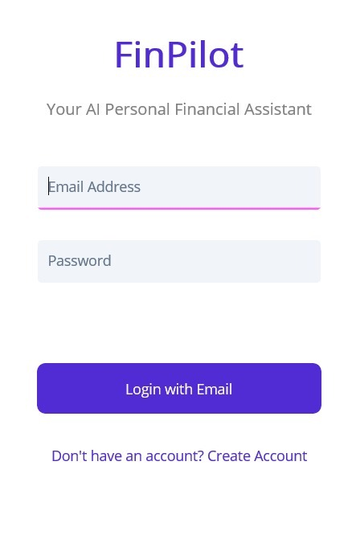
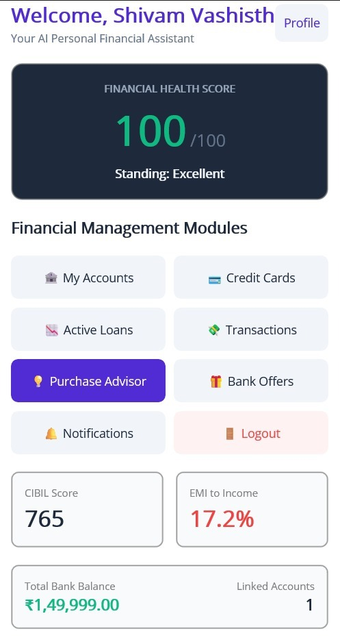
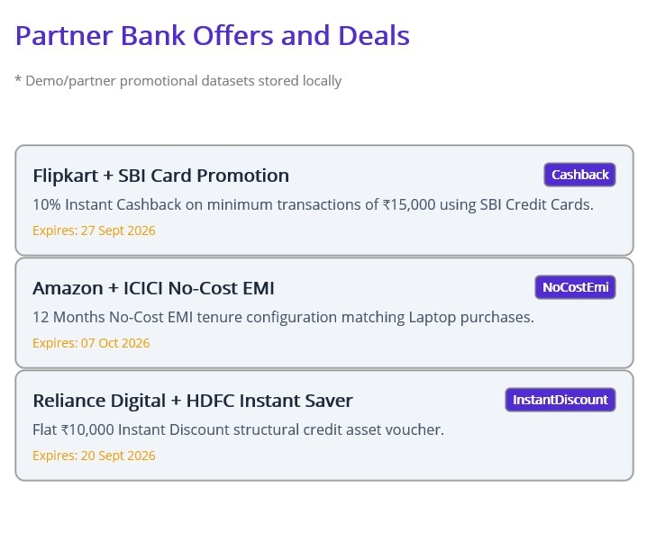
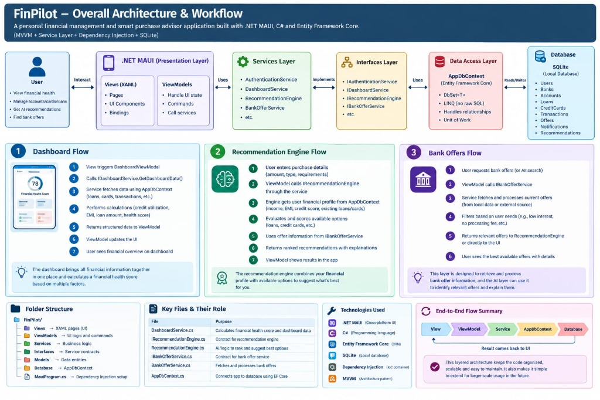

# FinPilot 🚀

[](https://dotnet.microsoft.com/en-us/apps/maui)
[](https://dotnet.microsoft.com/en-us/apps/maui)
[](https://docs.microsoft.com/en-us/ef/core/)
[](LICENSE)

**FinPilot** is a modern, cross-platform personal finance management and smart advisory application built with **.NET 10 MAUI**. FinPilot empowers users to take full control of their financial life with real-time account tracking, credit card management, loan tracking, intelligent purchase advisories, personalized bank offer comparisons, and notifications—all in a beautiful, responsive user interface.

---

## ✨ Features

- **📊 Comprehensive Financial Dashboard**
  - Unified overview of net worth, total balance, credit card debt, pending loan EMIs, and monthly spending analytics.
  - Interactive summary cards and quick-action shortcuts.

- **🏦 Multi-Account & Balance Management**
  - Track multiple checking, savings, and investment accounts.
  - Real-time balance updates and account-level transaction history.

- **💳 Credit Card Manager**
  - Monitor credit limits, outstanding balances, available credit, and due dates.
  - Smart alerts for high utilization and payment reminders.

- **📜 Loan & EMI Tracker**
  - Keep track of personal, home, vehicle, and education loans.
  - Monitor total loan balances, monthly EMIs, interest rates, and payback progress.

- **💸 Transaction History & Categorization**
  - Detailed log of income and expenses.
  - Filter and search by category, date range, or account.

- **🤖 Smart Purchase Advisor & Recommendation Engine**
  - Intelligent advice before making large purchases.
  - Analyzes current savings, debt-to-income ratio, and monthly budget to recommend whether a purchase is financially sound.

- **🎁 Bank Offers & Rewards Finder**
  - Curated catalog of credit card, loan, and cashback offers tailored to your spending habits and financial profile.

- **🔔 Smart Notifications & Alerts**
  - Timely alerts for bill due dates, EMI schedules, credit threshold warnings, and new promotional offers.

- **🔄 Local-First Storage & Cloud Synchronization**
  - Fast, offline-first experience powered by **SQLite** and **Entity Framework Core**.
  - Built-in support for seamless background synchronization.

---

## 📱 Screenshots

<div align="center">
  <table border="0">
    <tr>
      <td align="center" valign="top" width="30%">
        <b>Authentication</b><br/><br/>
        
      </td>
      <td align="center" valign="top" width="35%">
        <b>Financial Overview</b><br/><br/>
        
      </td>
      <td align="center" valign="top" width="35%">
        <b>Partner Deals & Offers</b><br/><br/>
        
      </td>
    </tr>
  </table>
</div>

---

## 📐 Overall Architecture & Workflow



---

## 🛠️ Tech Stack & Architecture

- **UI Framework**: [.NET 10 MAUI](https://dotnet.microsoft.com/en-us/apps/maui) (Single codebase targeting Android, iOS, macOS, Windows)
- **MVVM Pattern**: [CommunityToolkit.Mvvm](https://learn.microsoft.com/en-us/dotnet/communitytoolkit/mvvm/) for clean separation of concerns, data binding, and commands.
- **UI Components**: [CommunityToolkit.Maui](https://learn.microsoft.com/en-us/dotnet/communitytoolkit/maui/) for enhanced converters, popups, and behaviors.
- **Database / ORM**: [Entity Framework Core 10](https://docs.microsoft.com/en-us/ef/core/) with **SQLite** provider.
- **Source Generation**: XAML SourceGen enabled for rapid inflation and high runtime performance.
- **Dependency Injection**: `Microsoft.Extensions.DependencyInjection` for service lifecycle management (Singleton / Transient services).

---

## 📁 Repository Structure

```text
FinPilot/
├── docs/              # Architecture diagrams & app screenshots
│   └── images/        # Screenshot assets and system workflows
├── Converters/        # XAML value converters (e.g., IntToBoolConverter)
├── Database/          # EF Core AppDbContext & migration helpers
├── Interfaces/        # Service abstractions (IAccountService, ILoanTrackingService, etc.)
├── Messages/          # MVVM WeakReferenceMessenger pub/sub events
├── Models/            # Domain entities (User, BankAccount, CreditCard, Loan, Transaction, etc.)
├── Platforms/         # Platform-specific native code (Android, iOS, MacCatalyst, Windows)
├── Properties/        # Assembly properties & launch settings
├── Resources/         # App icons, splash screens, fonts, raw assets, images
├── Services/          # Core business logic, EF Core queries, recommendation algorithms
├── ViewModels/        # MVVM ViewModels powering all pages
├── Views/             # XAML pages & UI views
├── App.xaml / .cs     # Main app startup and lifecycle initialization
├── AppShell.xaml      # Navigation flyout/tab shell configuration
├── MauiProgram.cs     # App builder, DI container configuration & DB seeding
└── FinPilot.csproj    # .NET MAUI project file & NuGet dependencies
```

---

## 🚀 Getting Started

### Prerequisites

Before building FinPilot, ensure you have the following installed:

1. **[.NET 10 SDK](https://dotnet.microsoft.com/download/dotnet/10.0)** (or later)
2. **Visual Studio 2022 / Visual Studio Code** with:
   - .NET MAUI workload installed (`dotnet workload install maui`)
   - C# and .NET MAUI extensions (for VS Code)
3. Target Platform SDKs:
   - **Android**: Android SDK (API 21+) & Android Emulator / physical device
   - **Windows**: Windows 10/11 SDK (10.0.19041.0+) with Developer Mode enabled
   - **macOS / iOS** (Optional): Xcode 15+ & macOS environment

### 📦 Installation & Setup

1. **Clone the repository:**
   ```bash
   git clone https://github.com/Shivam-esperanza/FinPilot.git
   cd FinPilot
   ```

2. **Restore dependencies:**
   ```bash
   dotnet restore
   ```

3. **Build the project:**
   ```bash
   # Windows
   dotnet build -f net10.0-windows10.0.19041.0

   # Android
   dotnet build -f net10.0-android
   ```

4. **Run the application:**
   ```bash
   # Windows
   dotnet run -f net10.0-windows10.0.19041.0

   # Android (Make sure an emulator or device is connected)
   dotnet build -t:Run -f net10.0-android
   ```

---

## 🤝 Contributing

Contributions are welcome! If you'd like to report a bug, request a feature, or submit a pull request:

1. Fork the Project
2. Create your Feature Branch (`git checkout -b feature/AmazingFeature`)
3. Commit your Changes (`git commit -m 'Add some AmazingFeature'`)
4. Push to the Branch (`git checkout main` / `git push origin feature/AmazingFeature`)
5. Open a Pull Request

---

## 📄 License

This project is licensed under the MIT License - see the [LICENSE](LICENSE) file for details.

---

Crafted with ❤️ using **.NET MAUI**
